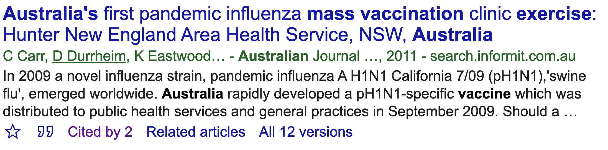
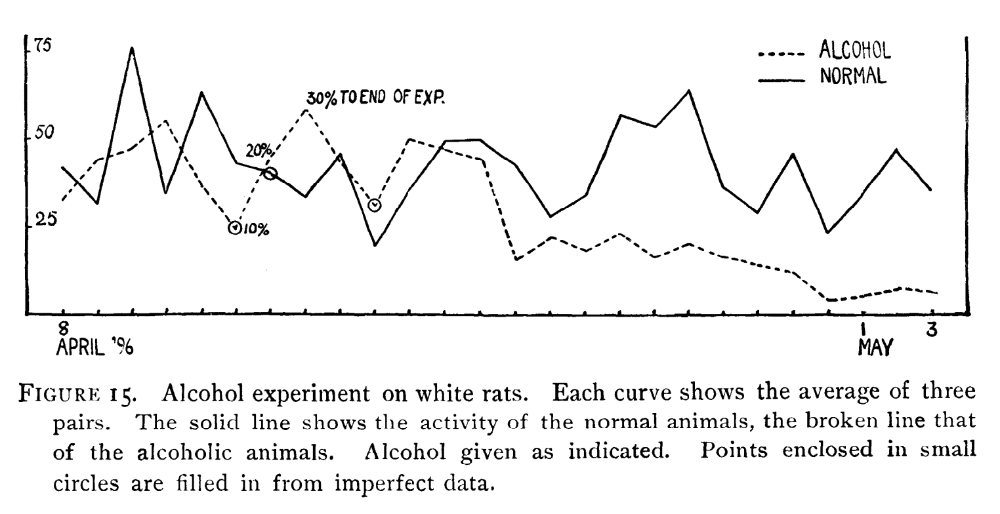
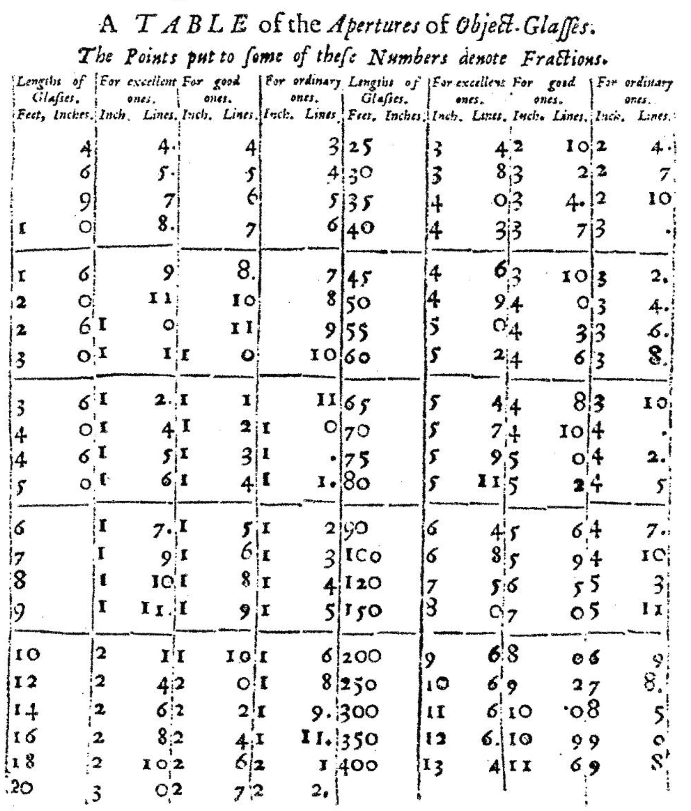
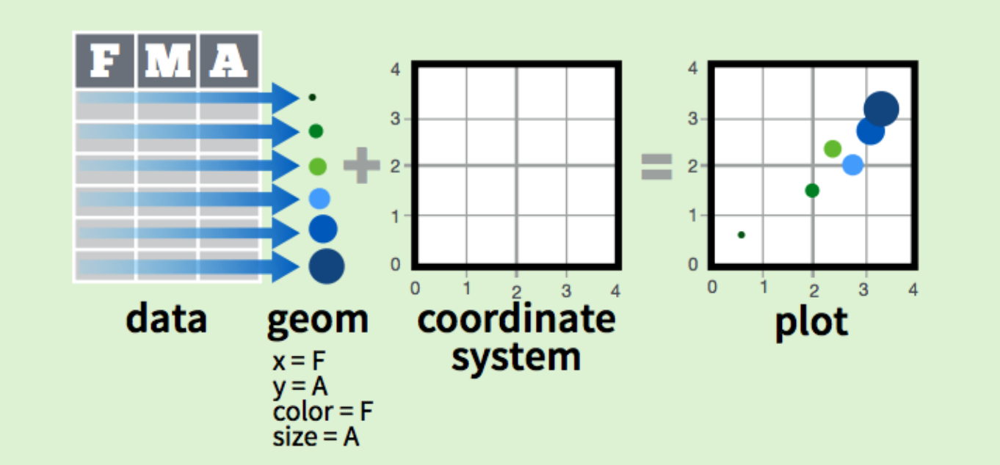
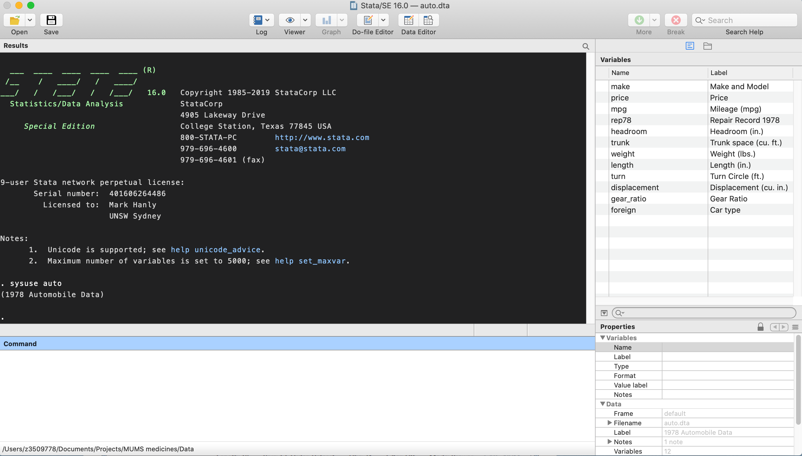
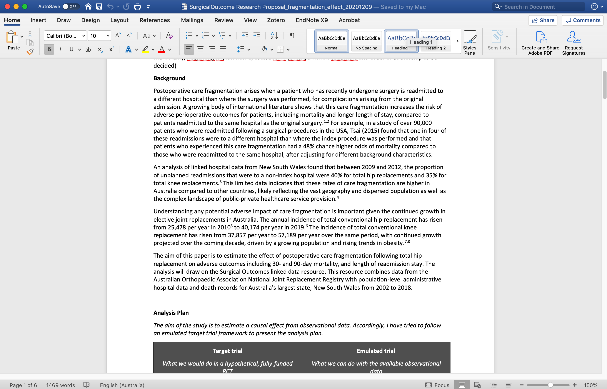
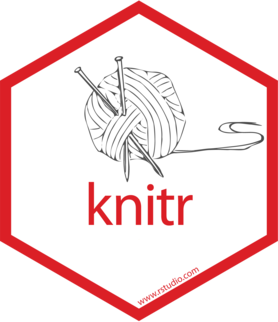
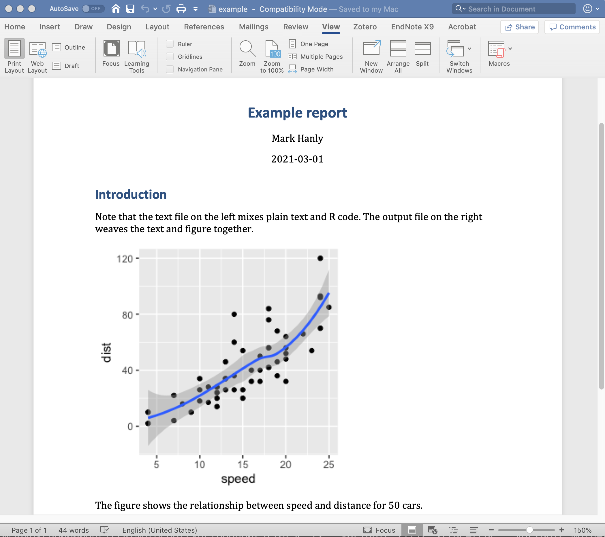
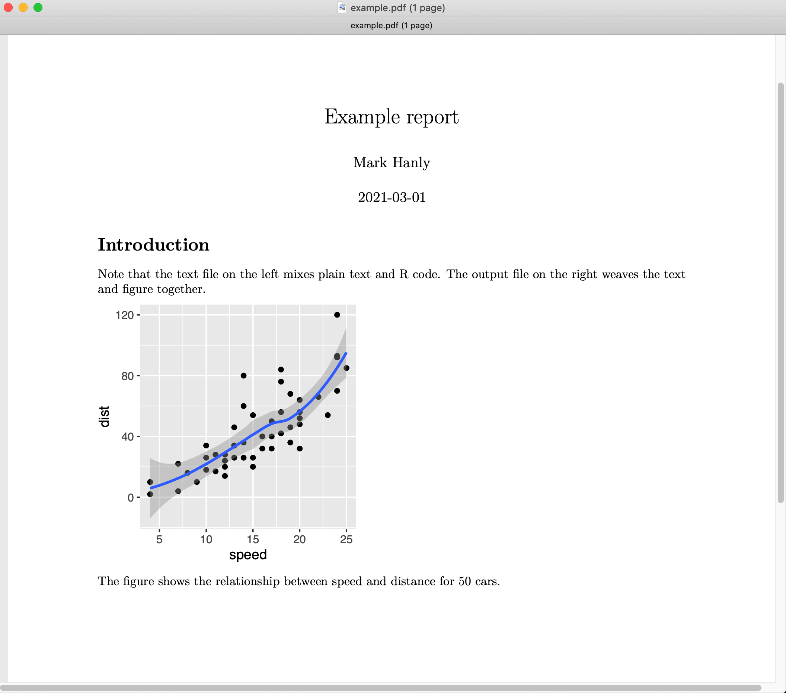
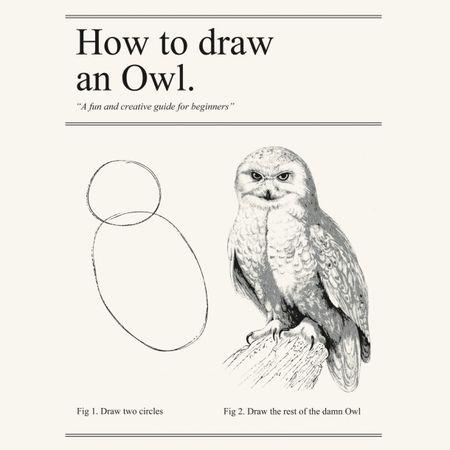

name: introductions
class: centre 

```{r, include = F}
# This is the recommended set up for flipbooks
# you might think about setting cache to TRUE as you gain practice --- building flipbooks from scratch can be time consuming
knitr::opts_chunk$set(fig.width = 6, message = FALSE, warning = FALSE, comment = "", cache = FALSE)
library(flipbookr)
library(tidyverse)
library(emo) # devtools::install_github("hadley/emo")
library(ggrepel)
library(datasauRus)
library(xaringanExtra) # devtools::install_github("gadenbuie/xaringanExtra")
library(ggiraph)
library(RColorBrewer)
library(gganimate)
library(xaringanthemer)

# xaringanThemer
style_mono_accent(base_color = "#3C989E")

# xaringanExtra
xaringanExtra::use_tile_view()

dailyVac <- readr::read_csv('https://raw.githubusercontent.com/owid/covid-19-data/master/public/data/vaccinations/vaccinations.csv')

ctryList <- c('Israel', 'Australia', 'United Kingdom', 'Vietnam', 'India', 'China', 'Germany', 'United States', 'Turkey', 'Argentina')
```


<!-- Visible slides start here -->

# Introductions

.pull-left[
  ## About me

- PhD
- CBDRH
# `r emo::ji("Ireland")`

]

--

.pull-right[

## About you (maybe?)
- MSc or PhD
- Quantitative 
- Health-orientated
- Coder
  - SAS/Stata/R/Python/SPSS
- Beginner -> Experienced

]

---
name: communicating-data
class: inverse, middle, center

# Data preparation accounts for about 80% of a data scientists* work

.right[*statistician/biostatistician/researcher]

---
name: communicating-data1
class: middle, center

## 80% data cleaning, 20% data analysis?

```{r, echo = FALSE, fig.width = 12}
x1 <- data.frame(
  activity = 1:4,
  start = c(0, 30, 44, 50),
  end = c(30, 44, 50, 100)
) %>% 
  pivot_longer(cols = c(start, end), 
               names_to = 'status', 
               values_to = 'time')

x1$activity <- factor(x1$activity, levels = 1:4, labels = c('Preparation', 'Data cleaning', 'Analysis', 'Dissemination'))


x1 %>% filter(activity %in% c('Data cleaning', 'Analysis')) %>% 
  ggplot(aes(x = time, y = droplevels(activity), color = droplevels(activity))) +
  geom_line(size = 20) +
  scale_y_discrete(name = NULL, limits = rev(c("Data cleaning", "Analysis"))) +
  scale_x_discrete('Time') +
  scale_color_manual(values = brewer.pal(4, 'Set1')[2:3]) +
  theme(legend.position = 'none', text = element_text(size = 30))
```

---
name: communicating-data2
class: middle, center

## The lifecycle of a research project is a little different

```{r, echo = FALSE, fig.width = 12}
x1 %>% 
ggplot(aes(x = time, y = activity, color = activity)) +
  geom_line(size = 20) +
  scale_y_discrete(name = NULL, limits = rev(levels(x1$activity))) +
  scale_x_discrete('Time') +
  scale_color_manual(values = brewer.pal(4, 'Set1')) +
  theme(legend.position = 'none', text = element_text(size = 30))
```

---
name: communicating-data2
class: top, center

## The dissmenation stage is indefinite
### For example...

--




---
class: center, middle, inverse

# The way we consume information has evolved rapidly 


---
class: left

.pull-left[
## The old model

- Hardcopy
- Slower
- Disconnected

]

.pull-right[
<iframe src="https://giphy.com/embed/i45Wufh14ggPMgSvrC" width="480" height="347" frameBorder="0" class="giphy-embed" allowFullScreen></iframe><p><a href="https://giphy.com/gifs/usnationalarchives-books-reading-library-i45Wufh14ggPMgSvrC">via GIPHY</a></p>
]

---
class: left

.pull-left[
## The new model

- Online
- High velocity
- Hyper-connected

]

.pull-right[
<iframe src="https://giphy.com/embed/9rtpurjbqiqZXbBBet" width="474" height="480" frameBorder="0" class="giphy-embed" allowFullScreen></iframe><p><a href="https://giphy.com/gifs/9rtpurjbqiqZXbBBet">via GIPHY</a></p>
]


---
class: center, middle, inverse

# The way we communicate data hasn't changed! 


---
class: center, top

## Can you see what is wrong with this plot?

```{r, echo = FALSE, fig.width = 12, fig.height = 5.5}
readr::read_csv('data/drunkrats.csv', col_types = list('n', 'f', 'n')) %>% 
  mutate(date = day + as.Date("1896-04-08")-1) %>% 
  ggplot() + 
  geom_vline(aes(xintercept = as.Date("1896-04-15")), color = 'gray50') +
  annotate("text", x = as.Date("1896-04-17"), y = 65, label = "30% to end of exp") +
  geom_line(aes(x = date, y = activity, color = status, linetype = status), size = 1.5) + 
  scale_x_date('Date', limits = c(as.Date("1896-04-08"), as.Date("1896-05-03")), 
               date_minor_breaks = 'day', date_labels = "%b %d") +
  scale_y_continuous('Activity', limits = c(0, 75), breaks = c(0, 25, 50, 75)) +
  scale_colour_discrete("") +
  scale_linetype_manual("", values=c(1,9)) + 
  theme(legend.position = c(0.9, 0.9), text = element_text(size = 20)) +
  labs(caption = str_wrap('Figure 15 Alcohol experiment on white rats. Each curve shows the average of 
                          three pairs. The solid line shows the activity of the normal animals, the 
                          broken line shows the activity of the alcoholic animals. Alcohol given as 
                          indicated.', 120))
```

--
# `r emo::ji("shrug")`


---
class: center, top

## Here's the original

```{r, echo = FALSE, out.width = 850}

```

--

.right[[`r emo::ji("link")` Stewart CC. American Journal of Physiology, Vol 1(1) January 1898](https://doi.org/10.1152/ajplegacy.1898.1.1.40)] 


---
class: inverse, center, middle

# In 120 years we have added colour! `r emo::ji("rocket")`

--
(Although the journal charges extra)


---
class: center, top

### The basic anatomy of a table hasn't changed since Newton's time

.pull-left[
```{r, echo = FALSE, out.width = 350}

```
]

.pull-right[

`r emo::ji("link")` [A Table of the Apertures of Object-Glasses. The Philosophical Transactions of the Royal Society, Vol 1(4) June 1665](https://en.wikisource.org/wiki/Philosophical_Transactions/Volume_1/Number_4)

>he intends to give the reason and demonstration in his Diopticks, which he is now writing, and intends to finish, as soon as his Health will permit.

]


---
name: outline
class: left, top

# Outline

.pull-left[
  ## What I plan to cover
  
The things you might present `r emo::ji("sailboat")`
- Graphs
- Tables
  
The medium `r emo::ji("island")`  
- Workflow
- Distribution platforms
  
]

--

.pull-right[

## What I won't cover
Other things relevant to data communication
- Delivering presentations 
- Engaging with policy-makers
- What to actually write/plot

]


---
class: center, bottom, title-slide
background-image: url("images/sailboat.jpg")
background-size: contain

.left[

# Figures and tables

]


---
name: figures-quote
class: inverse, centre, middle

# Figure quality is a paper’s suit and tie.

.right[&mdash; American Journal Experts (AJE) Report]


---
name: visualise-data

# A picture is worth 1000 words

## (or maybe 100 summary statistics)

--

```{r, include = FALSE}

dfLong <- datasauRus::datasaurus_dozen %>% 
  filter(dataset %in% c('dino'))

df <- datasauRus::datasaurus_dozen_wide %>% 
  transmute(x = dino_x, y = dino_y)
 

```

.pull-left[

```{r dino1, ECHO = TRUE, results = 'hide'}

head(df, n=10)

```

]

.pull-right[

```{r ref.label = 'dino1', echo = FALSE}
```

]


---

# A picture is worth 1000 words
## (or maybe 100 summary statistics)


.pull-left[

```{r dino2, ECHO = TRUE, results = 'hide'}

summary(df)

cor(df)
```

]

.pull-right[

```{r ref.label = 'dino2', echo = FALSE}
```

]


---

# A picture is worth 1000 words
## (or maybe 100 summary statistics)


.pull-left[

```{r dino3, ECHO = TRUE, results = 'hide', fig.show= 'hide'}

plot(df)

```

]


--

.pull-right[

```{r ref.label = 'dino3', echo = FALSE, fig.height = 6, fig.width = 6}
```

]


---
class: center, bottom, chapter-title 
background-image: url("images/chart-types-choosing-the-right-one.png")
background-size: contain

.right[`r emo::ji('link')` [www.ExtremePresentation.com](www.ExtremePresentation.com)]


---
class: center, middle, inverse

# The Grammer of Graphics

## A foundation to make _every_ type of graph


---
class: left 

## The Grammer of Graphics

.pull-left[

### Key components
**Data** The variables to plot

**Geom** The geometric shapes e.g. points/circles/lines/bars 

**Aesthetics** Appearance of the Geoms e.g. colour/fill/opacity 

**Coordinates** The scale of the axes e.g. cartesian/logistic/polar 

]

.pull-right[



#### Implemented in the R package `ggplot2`

```{r, echo = FALSE, out.width = 80, fig.align = 'center'}
knitr::include_graphics("images/hex-ggplot2.png")
```
]

.right[`r emo::ji('link')` [`ggplot2` cheatsheet](https://github.com/rstudio/cheatsheets/raw/master/data-visualization-2.1.pdf)]


---

## Versatility of `ggplot2` (Data and coordinate system)
.pull-left[
```{r ggplot-1, fig.show = 'hide'}

basePlot <- ggplot(data = iris, 
                   aes(x = Sepal.Length))

basePlot
```
]

.pull-right[
```{r ref.label = 'ggplot-1', echo = FALSE}

```
]

---

## Versatility of `ggplot2` (Density plot)
.pull-left[
```{r ggplot-2, fig.show = 'hide'}

basePlot <- ggplot(data = iris, 
                   aes(x = Sepal.Length))

basePlot + 
  geom_density() #<<

```
]

.pull-right[
```{r ref.label = 'ggplot-2', echo = FALSE}

```
]


---

## Versatility of `ggplot2` (Histogram)
.pull-left[
```{r ggplot-3, fig.show = 'hide'}

basePlot <- ggplot(data = iris, 
                   aes(x = Sepal.Length))

basePlot + 
  geom_histogram() #<<

```
]

.pull-right[
```{r ref.label = 'ggplot-3', echo = FALSE}

```
]


---

## Versatility of `ggplot2` (Dot plot)
.pull-left[
```{r ggplot-4, fig.show = 'hide'}

basePlot <- ggplot(data = iris, 
                   aes(x = Sepal.Length))

basePlot + 
  geom_dotplot() #<<

```
]

.pull-right[
```{r ref.label = 'ggplot-4', echo = FALSE}

```
]


---
class: large-text, left, top

## Tips for visualisation

--
- Label x and y axis appropriately (including units of measurement where relevant)

--
- Vary aesthetic elements to aid comparison 
    - Color
    - Size 
    - Line type

--
- Arrange geometric elements to aid comparison 
    - Ranking 
    - Faceting (multi-panel plots)
    - Line type

--
- Include narrative
    - Title
    - Caption
    - Annotations    
    
    
---
class: left, top

.left-column[
## A worked example
Start with a basic bar chart
]

.right-column[
```{r, echo = FALSE, fig.width = 12}
dailyVac %>% 
  filter(location %in% ctryList) %>% 
  group_by(location) %>% 
  slice_max(date) %>%
  select(location, total_vaccinations) %>% 
  ggplot() + 
  aes(x= location, y = total_vaccinations) + 
  geom_col() +
  theme(text = element_text(size = 16))
```
]

---
class: left, top

.left-column[
## A worked example
The country labels are a bit squished, let's flip the axes
]

.right-column[
```{r, echo = FALSE, fig.width = 12}
dailyVac %>% 
  filter(location %in% ctryList) %>% 
  group_by(location) %>% 
  slice_max(date) %>%
  select(location, total_vaccinations) %>% 
  ggplot() + 
  aes(x= location, y = total_vaccinations) + 
  geom_col() +
  coord_flip() +
  theme(text = element_text(size = 16))
```
]


---
class: left, top

.left-column[
## A worked example
Ordering the bars by size rather than alphabetically makes it easier to compare
]

.right-column[
```{r, echo = FALSE, fig.width = 12}
dailyVac %>% 
  filter(location %in% ctryList) %>% 
  group_by(location) %>% 
  slice_max(date) %>%
  select(location, total_vaccinations) %>% 
  ggplot() + 
  aes(x = reorder(location, total_vaccinations), y = total_vaccinations) + 
  geom_col() +
  coord_flip() +
  theme(text = element_text(size = 16))
```
]

---
class: left, top

.left-column[
## A worked example
Let's give some proper axes titles, because we're not total reprobates
]

.right-column[
```{r, echo = FALSE, fig.width = 12}
dailyVac %>% 
  filter(location %in% ctryList) %>% 
  group_by(location) %>% 
  slice_max(date) %>%
  select(location, total_vaccinations) %>% 
  ggplot() + 
  aes(x = reorder(location, total_vaccinations), y = total_vaccinations) + 
  geom_col() +
  coord_flip() +
  scale_x_discrete("Country") + 
  scale_y_continuous("Total vaccinations")  +
  theme(text = element_text(size = 16)) 
```
]

---
class: left, top

.left-column[
## A worked example
That's better, but it's still a bit hard to read the numbers on the x-axis. Let's change the labels to millions
]

.right-column[
```{r, echo = FALSE, fig.width = 12}
dailyVac %>% 
  filter(location %in% ctryList) %>% 
  group_by(location) %>% 
  slice_max(date) %>%
  select(location, total_vaccinations) %>% 
  ggplot() + 
  aes(x = reorder(location, total_vaccinations), y = total_vaccinations) + 
  geom_col() +
  coord_flip() +
  scale_x_discrete("Country") + 
  scale_y_continuous("Total vaccinations (millions)", label = seq(0,80,20))  +
  theme(text = element_text(size = 16))
```
]

---
class: left, top

.left-column[
## A worked example
We can map aesthetic features of the bars to the data. For example we can map the fill colour to the number of vaccinations...
]

.right-column[
```{r, echo = FALSE, fig.width = 12}
dailyVac %>% 
  filter(location %in% ctryList) %>% 
  group_by(location) %>% 
  slice_max(date) %>%
  select(location, total_vaccinations) %>% 
  ggplot() + 
  aes(x = reorder(location, total_vaccinations), y = total_vaccinations, fill = -total_vaccinations) + 
  geom_col() +
  coord_flip() +
  scale_x_discrete("Country") + 
  scale_y_continuous("Total vaccinations (millions)", label = seq(0,80,20)) + 
  scale_fill_continuous("Total vaccinations") +
  theme(text = element_text(size = 16))
```
]


---
class: left, top

.left-column[
## A worked example
...or we could map the fill colour to the discrete countries
]

.right-column[
```{r, echo = FALSE, fig.width = 12}
dailyVac %>% 
  filter(location %in% ctryList) %>% 
  group_by(location) %>% 
  slice_max(date) %>%
  select(location, total_vaccinations) %>% 
  ggplot() + 
  aes(x = reorder(location, total_vaccinations), y = total_vaccinations, fill = location) + 
  geom_col() +
  coord_flip() +
  scale_x_discrete("Country") + 
  scale_y_continuous("Total vaccinations (millions)", label = seq(0,80,20)) + 
  scale_fill_discrete("Country") +
  theme(text = element_text(size = 16))
```
]

---
class: left, top

.left-column[
## A worked example
Because the countries are labelled already, we can drop the legend
]

.right-column[
```{r, echo = FALSE, fig.width = 12}
dailyVac %>% 
  filter(location %in% ctryList) %>% 
  group_by(location) %>% 
  slice_max(date) %>%
  select(location, total_vaccinations) %>% 
  ggplot() + 
  aes(x = reorder(location, total_vaccinations), y = total_vaccinations, fill = location) + 
  geom_col() +
  coord_flip() +
  scale_x_discrete("Country") + 
  scale_y_continuous("Total vaccinations (millions)", label = seq(0,80,20)) + 
  scale_fill_discrete("Country") +
  theme(text = element_text(size = 16), legend.position = 'none')
```
]

---
class: left, top

.left-column[
## A worked example
Finally, let's add some narration with a title and legend
]

.right-column[
```{r, echo = FALSE, fig.width = 12}
dailyVac %>% 
  filter(location %in% ctryList) %>% 
  group_by(location) %>% 
  slice_max(date) %>%
  select(location, total_vaccinations) %>% 
  ggplot() + 
  aes(x = reorder(location, total_vaccinations), y = total_vaccinations, fill = location) + 
  geom_col() +
  coord_flip() +
  scale_x_discrete("Country") + 
  scale_y_continuous("Total vaccinations (millions)", label = seq(0,80,20)) + 
  scale_fill_discrete("Country") +
  theme(text = element_text(size = 16), legend.position = 'none') +
  labs(title = "Once upon a time, in a land far far away...",
       caption = "...and they all lived happily ever after.") 
```
]


---
class: left, top

.left-column[
## A worked example
Finally, let's add some narration with a title and legend
]

.right-column[
```{r, echo = FALSE, fig.width = 12}
dailyVac %>% 
  filter(location %in% ctryList) %>% 
  group_by(location) %>% 
  slice_max(date) %>%
  select(location, total_vaccinations) %>% 
  ggplot() + 
  aes(x = reorder(location, total_vaccinations), y = total_vaccinations, fill = location) + 
  geom_col() +
  coord_flip() +
  scale_x_discrete("Country") + 
  scale_y_continuous("Total vaccinations (millions)", label = seq(0,80,20)) + 
  scale_fill_discrete("Country") +
  theme(text = element_text(size = 16), legend.position = 'none') +
  labs(title = "Number of Covid-19 vaccinatations administered",
       caption = "Source: ourworldindata.org")  
```
]


---
name: flipbook-demo2

```{r timeVac, include = FALSE, echo = FALSE}

dailyVac %>% 
  filter(location %in% ctryList) %>% 
  group_by(location) %>% 
  select(location, daily_vaccinations_per_million, date) %>%
  mutate(label = if_else(date == max(date),
                         as.character(location), 
                         NA_character_)) %>% #BREAK
  ggplot() + #BREAK
  aes(x = date) + #BREAK 
  aes(y = daily_vaccinations_per_million) + #BREAK
  geom_line() +
  aes(group = location) + #BREAK
  aes(color = location) + #BREAK
  scale_x_date("Date") + #BREAK
  scale_y_continuous("Total vaccinations") + #BREAK
  scale_y_continuous("Total vaccinations (millions)", label = seq(0,80,20)) + #BREAK
  theme(legend.position = 'none') + #BREAK
  labs(title = "Number of Covid-19 vaccinatations administered") + #BREAK
  labs(caption = "Source: ourworldindata.org") + #BREAK
  geom_text_repel(aes(label = label)) + #BREAK
  scale_y_log10()
```

`r chunk_reveal("timeVac", break_type = "user")`


---
name: leaflet
class: center, top

## Interactive maps with 'leaflet'

.right[[`r emo::ji('link')` leaflet for R](https://rstudio.github.io/leaflet/)]

```{r, echo = FALSE}
library(leaflet)
leaflet(height=350,width=650) %>% 
  addTiles() %>%
  addMarkers(lat = c(-33.918172430083494, -33.905902691847984), 
             lng = c(151.2363559015195, 151.23545757637913), popup=c("CBDRH", "NDARC")) %>%
  setView(lat=-33.912569, lng=151.235464, zoom=14)
```


---
name: ggiraph
class: center, top

## Interactive plots with `ggiraph`

```{r, echo = FALSE}
ggi <- dailyVac %>% 
  filter(location %in% ctryList) %>% 
  group_by(location) %>% 
  select(location, daily_vaccinations_per_million, date) %>%
  mutate(label = if_else(date == max(date),  as.character(location), NA_character_),
         pointer = paste(location, "\n", date, "\n <strong>", 
                         format(daily_vaccinations_per_million, big.mark = ','), "<strong/>")) %>%  
  ggplot(aes(x = date, y = daily_vaccinations_per_million, color = location)) +  
  geom_point_interactive(aes(tooltip=pointer), alpha = 0.3) +
  geom_line() +
  scale_x_date("Date") +  
  scale_y_continuous("Total vaccinations per million pop") + 
  theme(legend.position = 'none') +  
  labs(title = "Number of Covid-19 vaccinatations administered") +  
  labs(caption = "Source: ourworldindata.org") 

h <- girafe(code = print(ggi), width_svg = 8, height_svg = 5)
htmlwidgets::saveWidget(h, "widgets/ggiraph.html")
```

<iframe src="widgets/ggiraph.html" width = "800" height = "500" scrolling="no" seamless="seamless" frameBorder="0"></iframe>


---
name: plotly
class: center, top

## Interactive plots with `plotly`

```{r, echo = FALSE}
ggp <- dailyVac %>% 
  filter(location %in% ctryList) %>% 
  group_by(location) %>% 
  select(location, daily_vaccinations_per_million, date) %>%
  mutate(label = if_else(date == max(date),  as.character(location), NA_character_),
         pointer = paste(location, "\n", date, "\n <strong>", 
                         format(daily_vaccinations_per_million, big.mark = ','), "<strong/>")) %>%  
  ggplot(aes(x = date, y = daily_vaccinations_per_million, color = location)) +  
  geom_point(alpha = 0.3) +
  geom_line() +
  scale_x_date("Date") +  
  scale_y_continuous("Total vaccinations per million pop") + 
  theme(legend.position = 'none') +  
  labs(title = "Number of Covid-19 vaccinatations administered") +  
  labs(caption = "Source: ourworldindata.org") 

p <- plotly::ggplotly(ggp)
htmlwidgets::saveWidget(p, "widgets/plotly.html")
```

<iframe src="widgets/plotly.html" width = "800" height = "500" scrolling="no" seamless="seamless" frameBorder="0"></iframe>


---
name: animate
class: center, top

## Animated plots with `gganimate`

<!-- # Create the animation -->
<!-- anim <- dailyVac %>%  -->
<!--   filter(location %in% ctryList) %>%  -->
<!--   group_by(location) %>%  -->
<!--   select(location, daily_vaccinations_per_million, date) %>%   -->
<!--   ggplot(aes(x = date, y = daily_vaccinations_per_million, color = location)) +   -->
<!--   geom_point(alpha = 0.3) + -->
<!--   geom_line() + -->
<!--   scale_x_date("Date") +   -->
<!--   scale_y_continuous("Total vaccinations per million pop") +  -->
<!--   scale_color_discrete(name = 'Country') + -->
<!--   labs(title = "Number of Covid-19 vaccinatations administered") +   -->
<!--   labs(title = 'Percent of population vaccinated with two doses', -->
<!--        subtitle = "Date: {frame_along}", caption = "Source: ourworldindata.org") + -->
<!--   transition_reveal(date) -->

<!-- # Animate -->
<!-- animate(anim, -->
<!--         height = 500, -->
<!--         width = 800, -->
<!--         nframes = 400, -->
<!--         fps = 20, -->
<!--         renderer = gifski_renderer(loop = TRUE)) -->

<!-- # Save -->
<!-- anim_save('widgets/gif-1.gif') -->

<iframe src="widgets/gif-1.gif" width="800" height="500" frameBorder="0" class="giphy-embed" allowFullScreen></iframe>


---
name: animate-map
class: center, top

.right[<p><a href="https://d4tagirl.com/2017/05/how-to-plot-animated-maps-with-gganimate">source: d4tagirl.com</a></p>]

<iframe src="https://d4tagirl.com/post/how-to-plot-animated-maps-with-gganimate/2017-04-24-how-to-plot-animated-maps-with-gganimate/ani_map_less_frames.gif" width="900" height="600" frameBorder="0" class="giphy-embed" allowFullScreen></iframe>


---
name: shiny-example
class: top, left

.left-column[

### `R Shiny`

- Interactive applications
- dashboards

]

.right-column[
<iframe src="https://cbdrh.shinyapps.io/vaccinations-demo-app/" width="800" height="600" frameBorder="0" allowFullScreen></iframe>
]

.right[https://cbdrh.shinyapps.io/vaccinations-demo-app/]


---
class: center, bottom, title-slide
background-image: url("images/sea.jpg")
background-size: contain

.left[

# Workflow

]


---
name: plain-text
class: center, middle, inverse

.left-column[
  
]

.right-column[

# if you’re in the early phase of your career as a graduate student... you should give some thought to how you’re going to organize and manage your work

.right[plain-text.co/index.html]


]


---
name: software-tasks
class: centre, inverse

# Two software tasks

--

.pull-left[
  ## 1. Statistical analysis
  
  

]

--

.pull-right[

## 2. Communicating results


]

---
name: approaches
class: centre, inverse

# Two approaches

--

.pull-left[
  ## Office model
  
1. Analyse data in Excel/Stata/whatever
1. Cut and paste output into Word doc
1. Write report


]

--

.pull-right[

## Engineering model

1. Write a single text file that includes 
    - analysis code 
    - text of report
1. Weave together analysis output and text

]

--
<br>
<br>
.left[The engineering model is also referred to as _literate programming_]

---
name: benefits
class: inverse, left, top, large-font 

# Benefits of Literate Programming

1. Transparent
1. Reproducible
1. Automated
1. Versioned
1. Backed up


---
name: rmarkdown
class: left, top

# Implementation of literate programming 

.pull-left[

## Rmarkdown

 
- Plain text
- R code

]

.pull-right[

## Knitr 


- "knit" the output together

]

---
name: rmarkdown-example
class: inverse, center, top
background-image: url("images/rmarkdown-example.png")
background-size: contain


---
name: knit-to-word
class: center, top

# output: word_document


---
name: knit-to-pdf
class: center, top

# output: pdf_document




---
name: rmarkdown-extensions
class: left

# Extensions to using `distill`

## Blogs 
- e.g. https://timchurches.github.io/blog/
- https://rstudio.github.io/distill/

## Webpages
- https://pkgs.rstudio.com/distill/articles/examples.html


---
name: software-comparison
class: inverse, center, middle
background-image: url("images/software-comparison.jpg")
background-size: contain


---
name: draw-owl
class: left, middle

## Next steps

.left-column[

### Today: 
Figure 1

### Next 3 years:
Figure 2

]

.right-column[


]

.footnote[
The slides and links will be made available after the talk so you can follow up on the bits you are interested in.
]

---
name: resources

# Resources

STAT545, Data wrangling, exploration, and analysis with R, Professor Jenny Bryan, UBC
https://stat545.com/index.html


The Plain Person's Guide to Plain Text Social Science, Professor Kieran Healy, Duke University

Introduction to R course with UNSW StatsCentral https://www.analytical.unsw.edu.au/facilities/stats-central/online-short-courses

Data visualisation with `ggplot2` cheatsheet https://github.com/rstudio/cheatsheets/raw/master/data-visualization-2.1.pdf

<!-- Default css code -->

```{css, eval = TRUE, echo = FALSE}
.remark-code{line-height: 1.5; font-size: 80%}

@media print {
  .has-continuation {
    display: block;
  }
}

code.r.hljs.remark-code{
  position: relative;
  overflow-x: hidden;
}


code.r.hljs.remark-code:hover{
  overflow-x:visible;
  width: 500px;
  border-style: solid;
}

.remark-slide-content {
    font-size: 22px;
    padding: 1em 4em 1em 4em;
}

.large-font {
  font-size: 32px;
}

.chapter-slide {
font-weight: normal;
font-size: 60px;
color: white;
background-color: white; }

```
