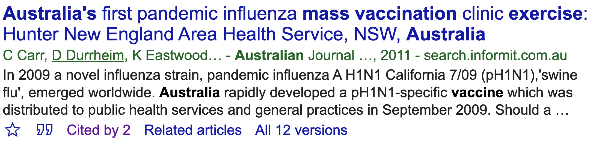
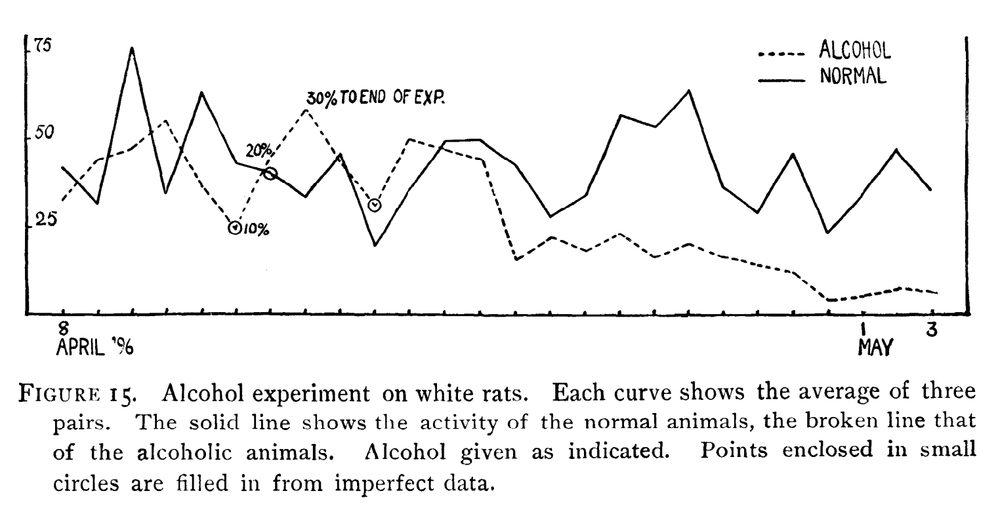
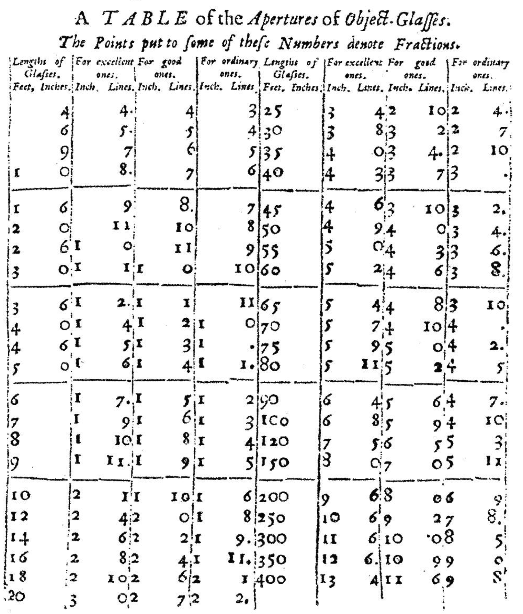
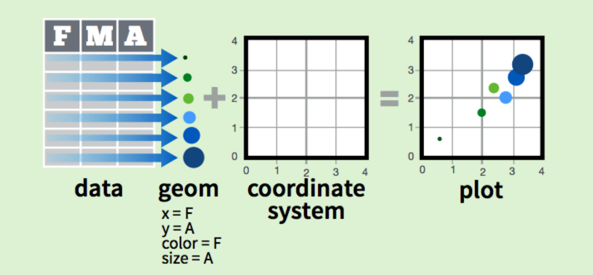
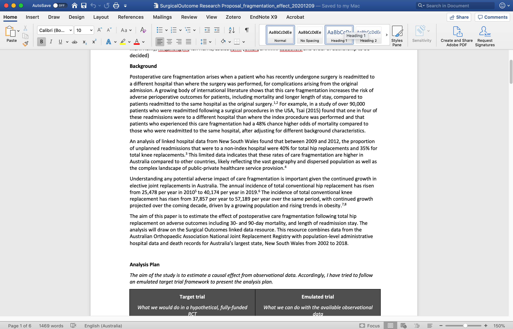
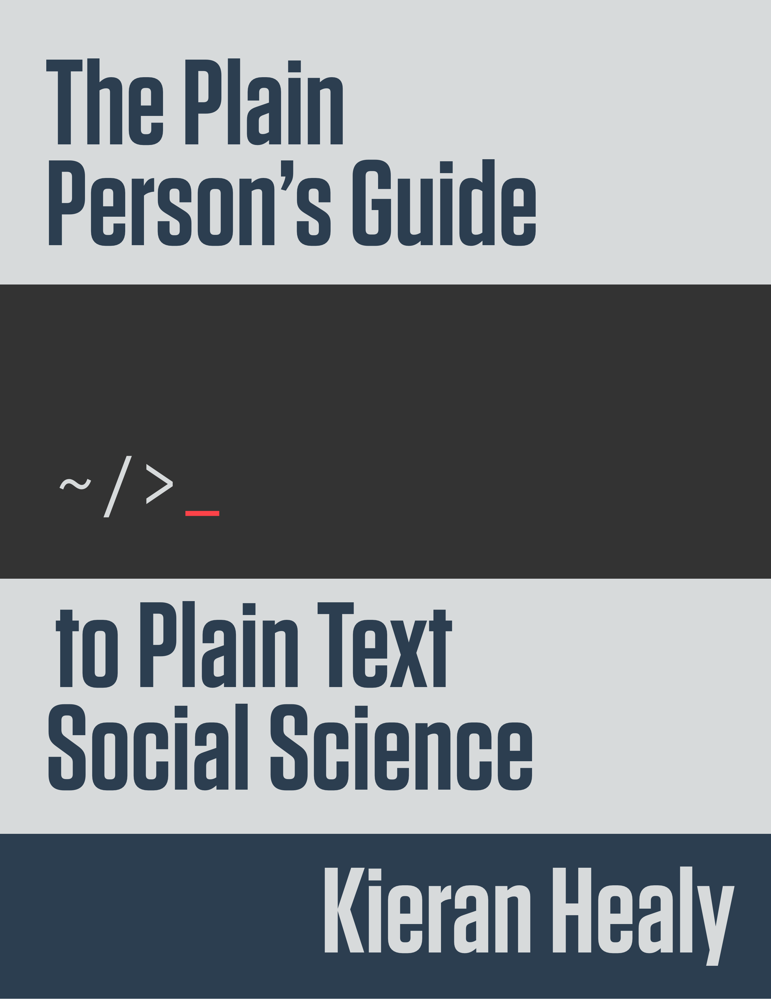
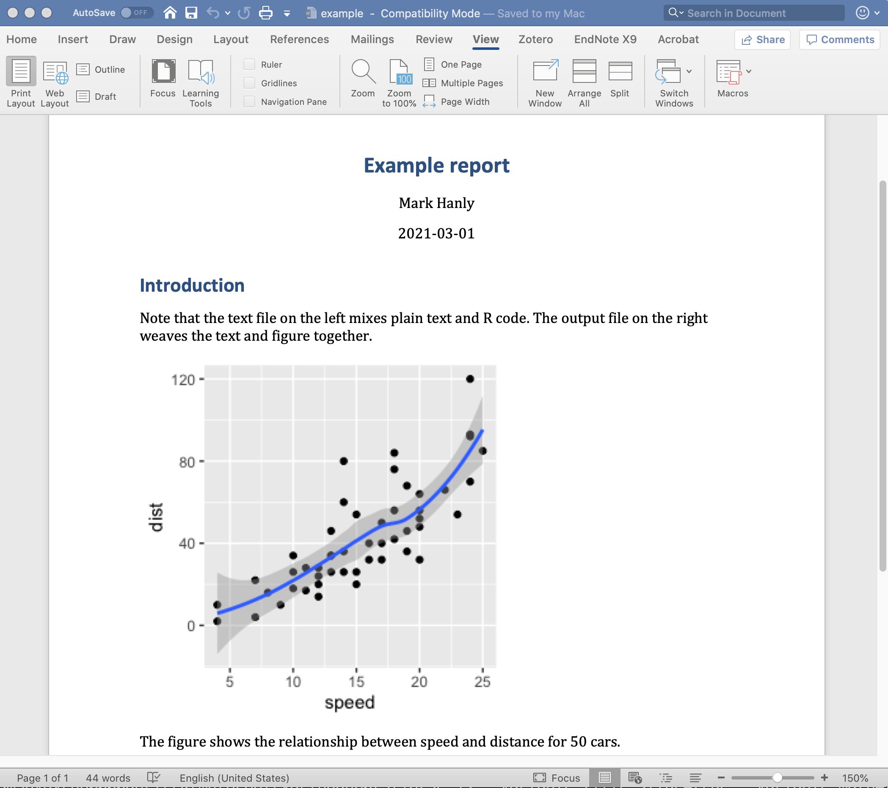
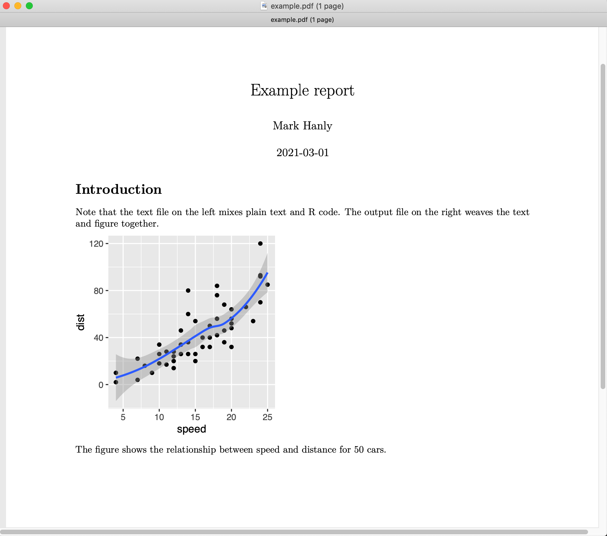

name: introductions
class: centre 

```{r, include = F}
# This is the recommended set up for flipbooks
# you might think about setting cache to TRUE as you gain practice --- building flipbooks from scratch can be time consuming
knitr::opts_chunk$set(fig.width = 6, message = FALSE, warning = FALSE, comment = "", cache = FALSE)
library(flipbookr)
library(tidyverse)
library(emo) # devtools::install_github("hadley/emo")
library(ggrepel)
library(datasauRus)
library(xaringanExtra) # devtools::install_github("gadenbuie/xaringanExtra")
library(ggiraph)
library(RColorBrewer)
library(gganimate)
library(xaringanthemer)
library(kableExtra)
library(DT)
library(sparkline)
sparkline(0)

# xaringanThemer #3C989E
style_mono_accent(base_color = "#000033")

# xaringanExtra
xaringanExtra::use_tile_view()

dailyVac <- readr::read_csv('https://raw.githubusercontent.com/owid/covid-19-data/master/public/data/vaccinations/vaccinations.csv')

ctryList <- c('Israel', 'Australia', 'United Kingdom', 'India', 'China', 'Germany', 'United States', 'Turkey', 'Argentina')

dt <- mtcars[1:5, 1:6]

```


<!-- Visible slides start here -->

# Introductions

## About me

### `r emo::ji("boy")` `r emo::ji("Ireland")`  `r emo::ji("forward")` `r emo::ji("student")` `r emo::ji("United_Kingdom")` `r emo::ji("forward")` `r emo::ji("professor")` `r emo::ji("Australia")`

- Child health and development | Joint replacements | Infectious disease

- SPSS | Stata | SAS | R 

- Not really a 'computery' person

.right[`r emo::ji('email')` m.hanly@unsw.edu.au]

### `r emo::ji("bike")` `r emo::ji("beers")` `r emo::ji("canoe")` `r emo::ji("books")`

---
class: centre

## About you (maybe?)

### `r emo::ji("student")` MSc | PhD | ECR
### `r emo::ji("graph")` Quantitative
### `r emo::ji("health")` Health-orientated 
### `r emo::ji("computer")` Coder (SAS | SPSS | R | Python | Stata)
### `r emo::ji("pencil")` Beginner | Experienced | Learner


---
name: communicating-data
class: inverse, middle, center

# Data preparation accounts for about 80% of a data scientists* work

.right[*statistician/biostatistician/researcher]

---
name: communicating-data1
class: middle, center

## 80% data cleaning, 20% data analysis?

```{r, echo = FALSE, fig.width = 12}
x1 <- data.frame(
  activity = 1:4,
  start = c(0, 30, 44, 50),
  end = c(30, 44, 50, 100)
) %>% 
  pivot_longer(cols = c(start, end), 
               names_to = 'status', 
               values_to = 'time')

x1$activity <- factor(x1$activity, levels = 1:4, labels = c('Preparation', 'Data cleaning', 'Analysis', 'Dissemination'))


x1 %>% filter(activity %in% c('Data cleaning', 'Analysis')) %>% 
  ggplot(aes(x = time, y = droplevels(activity), color = droplevels(activity))) +
  geom_line(size = 20) +
  scale_y_discrete(name = NULL, limits = rev(c("Data cleaning", "Analysis"))) +
  scale_x_discrete('Time') +
  scale_color_manual(values = brewer.pal(4, 'Set1')[2:3]) +
  theme(legend.position = 'none', text = element_text(size = 30))
```

---
name: communicating-data2
class: middle, center

## The lifecycle of a research project is a little different

```{r, echo = FALSE, fig.width = 12}
x1 %>% 
ggplot(aes(x = time, y = activity, color = activity)) +
  geom_line(size = 20) +
  scale_y_discrete(name = NULL, limits = rev(levels(x1$activity))) +
  scale_x_discrete('Time') +
  scale_color_manual(values = brewer.pal(4, 'Set1')) +
  theme(legend.position = 'none', text = element_text(size = 30))
```

---
name: communicating-data2
class: top, center

## The dissmenation stage is indefinite
### For example...

--




---
class: center, middle, inverse

# The way we consume information has evolved rapidly 


---
class: left

.pull-left[
## The old model

- Hardcopy
- Slower
- Disconnected

]

.pull-right[
<iframe src="https://giphy.com/embed/1iu8uG2cjYFZS6wTxv" width="384" height="480" frameBorder="0" class="giphy-embed" allowFullScreen></iframe><p><a href="https://giphy.com/gifs/kitty-smart-1iu8uG2cjYFZS6wTxv">via GIPHY</a></p>
]

---
class: left

.pull-left[
## The new model

- Online
- High velocity
- Hyper-connected

]

.pull-right[
<iframe src="https://giphy.com/embed/9rtpurjbqiqZXbBBet" width="474" height="480" frameBorder="0" class="giphy-embed" allowFullScreen></iframe><p><a href="https://giphy.com/gifs/9rtpurjbqiqZXbBBet">via GIPHY</a></p>
]


---
class: center, middle, inverse

# The way we communicate data hasn't changed! 


---
class: center, top

## Can you see what is wrong with this plot?

```{r, echo = FALSE, fig.width = 12, fig.height = 5.5}
readr::read_csv('data/drunkrats.csv', col_types = list('n', 'f', 'n')) %>% 
  mutate(date = day + as.Date("1896-04-08")-1) %>% 
  ggplot() + 
  geom_vline(aes(xintercept = as.Date("1896-04-15")), color = 'gray50') +
  annotate("text", x = as.Date("1896-04-17"), y = 65, label = "30% to end of exp") +
  geom_line(aes(x = date, y = activity, color = status, linetype = status), size = 1.5) + 
  scale_x_date('Date', limits = c(as.Date("1896-04-08"), as.Date("1896-05-03")), 
               date_minor_breaks = 'day', date_labels = "%b %d") +
  scale_y_continuous('Activity', limits = c(0, 75), breaks = c(0, 25, 50, 75)) +
  scale_colour_discrete("") +
  scale_linetype_manual("", values=c(1,9)) + 
  theme(legend.position = c(0.9, 0.9), text = element_text(size = 20)) +
  labs(caption = str_wrap('Figure 15 Alcohol experiment on white rats. Each curve shows the average of 
                          three pairs. The solid line shows the activity of the normal animals, the 
                          broken line shows the activity of the alcoholic animals. Alcohol given as 
                          indicated.', 120))
```

--
# `r emo::ji("shrug")`


---
class: center, top

## Here's the original

```{r, echo = FALSE, out.width = 850}

```

--

.right[[`r emo::ji("link")` Stewart CC. American Journal of Physiology, Vol 1(1) January 1898](https://doi.org/10.1152/ajplegacy.1898.1.1.40)] 


---
class: inverse, center, middle

# In 120 years we have added colour! `r emo::ji("rocket")`

--
(Although the journal charges extra)


---
class: center, top

### The basic anatomy of a table hasn't changed since Newton's time

.pull-left[
```{r, echo = FALSE, out.width = 350}

```
]

.pull-right[

`r emo::ji("link")` [Adrien Auzout, A Table of the Apertures of Object-Glasses. The Philosophical Transactions of the Royal Society, Vol 1(4) June 1665](https://en.wikisource.org/wiki/Philosophical_Transactions/Volume_1/Number_4)

>he intends to give the reason and demonstration in his Diopticks, which he is now writing, and intends to finish, as soon as his Health will permit.

]


---
name: outline
class: left, top

# Outline

.pull-left[
  ## What I plan to cover
  
The vessel for your communication `r emo::ji("sailboat")`
- Graphs
- Tables
  
The medium `r emo::ji("island")`  
- Workflow
- Distribution platforms
  
]

--

.pull-right[

## What I won't cover
Other things relevant to data communication
- Delivering presentations 
- Engaging with policy-makers
- What to actually write/plot

]


---
class: center, bottom, title-slide
background-image: url("images/sailboat.jpg")
background-size: contain

.left[
# Figures 
]


---
name: visualise-data

# A picture is worth 1000 words

## (or maybe 100 summary statistics)

--

```{r, include = FALSE}

dfLong <- datasauRus::datasaurus_dozen %>% 
  filter(dataset %in% c('dino'))

df <- datasauRus::datasaurus_dozen_wide %>% 
  transmute(x = dino_x, y = dino_y)
 

```

.pull-left[

```{r dino1, ECHO = TRUE, results = 'hide'}

head(df, n=10)

```

]

.pull-right[

```{r ref.label = 'dino1', echo = FALSE}
```

]


---

# A picture is worth 1000 words
## (or maybe 100 summary statistics)


.pull-left[

```{r dino2, ECHO = TRUE, results = 'hide'}

summary(df)

cor(df)
```

]

.pull-right[

```{r ref.label = 'dino2', echo = FALSE}
```

]


---

# A picture is worth 1000 words
## (or maybe 100 summary statistics)


.pull-left[

```{r dino3, ECHO = TRUE, results = 'hide', fig.show= 'hide'}

plot(df)

```

]


--

.pull-right[

```{r ref.label = 'dino3', echo = FALSE, fig.height = 6, fig.width = 6}
```

]


---
class: center, bottom, chapter-title 
background-image: url("images/chart-types-choosing-the-right-one.png")
background-size: contain

.right[`r emo::ji('link')` [www.ExtremePresentation.com](www.ExtremePresentation.com)]


---
class: center, middle, inverse

# The Grammer of Graphics

## A foundation to make _every_ type of graph


---
class: left 

## The Grammer of Graphics

.pull-left[

### Key components
**Data** The variables to plot

**Geom** The geometric shapes e.g. points/circles/lines/bars 

**Aesthetics** Appearance of the Geoms e.g. colour/fill/opacity 

**Coordinates** The scale of the axes e.g. cartesian/logistic/polar 

]

.pull-right[



#### Implemented in the R package `ggplot2`

```{r, echo = FALSE, out.width = 80, fig.align = 'center'}
knitr::include_graphics("images/hex-ggplot2.png")
```
]

.right[`r emo::ji('link')` [`ggplot2` cheatsheet](https://github.com/rstudio/cheatsheets/raw/master/data-visualization-2.1.pdf)]


---

## Versatility of `ggplot2` (Data and coordinate system)
.pull-left[
```{r ggplot-1, fig.show = 'hide'}

basePlot <- ggplot(data = iris, 
                   aes(x = Sepal.Length))

basePlot
```
]

.pull-right[
```{r ref.label = 'ggplot-1', echo = FALSE}

```
]

---

## Versatility of `ggplot2` (Density plot)
.pull-left[
```{r ggplot-2, fig.show = 'hide'}

basePlot <- ggplot(data = iris, 
                   aes(x = Sepal.Length))

basePlot + 
  geom_density() #<<

```
]

.pull-right[
```{r ref.label = 'ggplot-2', echo = FALSE}

```
]


---

## Versatility of `ggplot2` (Histogram)
.pull-left[
```{r ggplot-3, fig.show = 'hide'}

basePlot <- ggplot(data = iris, 
                   aes(x = Sepal.Length))

basePlot + 
  geom_histogram() #<<

```
]

.pull-right[
```{r ref.label = 'ggplot-3', echo = FALSE}

```
]


---

## Versatility of `ggplot2` (Dot plot)
.pull-left[
```{r ggplot-4, fig.show = 'hide'}

basePlot <- ggplot(data = iris, 
                   aes(x = Sepal.Length))

basePlot + 
  geom_dotplot() #<<

```
]

.pull-right[
```{r ref.label = 'ggplot-4', echo = FALSE}

```
]


---
class: large-text, left, top

## Tips for visualisation

--

- Label x and y axis appropriately (including units of measurement where relevant)

--

- Vary aesthetic elements to aid comparison 
    - Color
    - Size 
    - Line type

--

- Arrange geometric elements to aid comparison 
    - Ranking 
    - Faceting (multi-panel plots)
    - Line type

--

- Include narrative
    - Title
    - Caption
    - Annotations    
    
    
---
class: left, top

.left-column[
## A worked example
Start with a basic bar chart
]

.right-column[
```{r, echo = FALSE, fig.width = 12}
dailyVac %>% 
  filter(location %in% ctryList) %>% 
  group_by(location) %>% 
  slice_max(date) %>%
  select(location, total_vaccinations) %>% 
  ggplot() + 
  aes(x= location, y = total_vaccinations) + 
  geom_col() +
  theme(text = element_text(size = 16))
```
]

---
class: left, top

.left-column[
## A worked example
The country labels are a bit squished, let's flip the axes
]

.right-column[
```{r, echo = FALSE, fig.width = 12}
dailyVac %>% 
  filter(location %in% ctryList) %>% 
  group_by(location) %>% 
  slice_max(date) %>%
  select(location, total_vaccinations) %>% 
  ggplot() + 
  aes(x= location, y = total_vaccinations) + 
  geom_col() +
  coord_flip() +
  theme(text = element_text(size = 16))
```
]


---
class: left, top

.left-column[
## A worked example
Ordering the bars by size rather than alphabetically makes it easier to compare
]

.right-column[
```{r, echo = FALSE, fig.width = 12}
dailyVac %>% 
  filter(location %in% ctryList) %>% 
  group_by(location) %>% 
  slice_max(date) %>%
  select(location, total_vaccinations) %>% 
  ggplot() + 
  aes(x = reorder(location, total_vaccinations), y = total_vaccinations) + 
  geom_col() +
  coord_flip() +
  theme(text = element_text(size = 16))
```
]

---
class: left, top

.left-column[
## A worked example
Let's give some proper axes titles, because we're not total reprobates
]

.right-column[
```{r, echo = FALSE, fig.width = 12}
dailyVac %>% 
  filter(location %in% ctryList) %>% 
  group_by(location) %>% 
  slice_max(date) %>%
  select(location, total_vaccinations) %>% 
  ggplot() + 
  aes(x = reorder(location, total_vaccinations), y = total_vaccinations) + 
  geom_col() +
  coord_flip() +
  scale_x_discrete("Country") + 
  scale_y_continuous("Total vaccinations")  +
  theme(text = element_text(size = 16)) 
```
]

---
class: left, top

.left-column[
## A worked example
That's better, but it's still a bit hard to read the numbers on the x-axis. Let's change the labels to millions
]

.right-column[
```{r, echo = FALSE, fig.width = 12}
dailyVac %>% 
  filter(location %in% ctryList) %>% 
  group_by(location) %>% 
  slice_max(date) %>%
  select(location, total_vaccinations) %>% 
  ggplot() + 
  aes(x = reorder(location, total_vaccinations), y = total_vaccinations) + 
  geom_col() +
  coord_flip() +
  scale_x_discrete("Country") + 
  scale_y_continuous("Total vaccinations (millions)", label = seq(0,80,20))  +
  theme(text = element_text(size = 16))
```
]

---
class: left, top

.left-column[
## A worked example
We can map aesthetic features of the bars to the data. For example we can map the fill colour to the number of vaccinations...
]

.right-column[
```{r, echo = FALSE, fig.width = 12}
dailyVac %>% 
  filter(location %in% ctryList) %>% 
  group_by(location) %>% 
  slice_max(date) %>%
  select(location, total_vaccinations) %>% 
  ggplot() + 
  aes(x = reorder(location, total_vaccinations), y = total_vaccinations, fill = -total_vaccinations) + 
  geom_col() +
  coord_flip() +
  scale_x_discrete("Country") + 
  scale_y_continuous("Total vaccinations (millions)", label = seq(0,80,20)) + 
  scale_fill_continuous("Total vaccinations") +
  theme(text = element_text(size = 16))
```
]


---
class: left, top

.left-column[
## A worked example
...or we could map the fill colour to the discrete countries
]

.right-column[
```{r, echo = FALSE, fig.width = 12}
dailyVac %>% 
  filter(location %in% ctryList) %>% 
  group_by(location) %>% 
  slice_max(date) %>%
  select(location, total_vaccinations) %>% 
  ggplot() + 
  aes(x = reorder(location, total_vaccinations), y = total_vaccinations, fill = location) + 
  geom_col() +
  coord_flip() +
  scale_x_discrete("Country") + 
  scale_y_continuous("Total vaccinations (millions)", label = seq(0,80,20)) + 
  scale_fill_discrete("Country") +
  theme(text = element_text(size = 16))
```
]

---
class: left, top

.left-column[
## A worked example
Because the countries are labelled already, we can drop the legend
]

.right-column[
```{r, echo = FALSE, fig.width = 12}
dailyVac %>% 
  filter(location %in% ctryList) %>% 
  group_by(location) %>% 
  slice_max(date) %>%
  select(location, total_vaccinations) %>% 
  ggplot() + 
  aes(x = reorder(location, total_vaccinations), y = total_vaccinations, fill = location) + 
  geom_col() +
  coord_flip() +
  scale_x_discrete("Country") + 
  scale_y_continuous("Total vaccinations (millions)", label = seq(0,80,20)) + 
  scale_fill_discrete("Country") +
  theme(text = element_text(size = 16), legend.position = 'none')
```
]

---
class: left, top

.left-column[
## A worked example
Finally, let's add some narration with a title and legend
]

.right-column[
```{r, echo = FALSE, fig.width = 12}
dailyVac %>% 
  filter(location %in% ctryList) %>% 
  group_by(location) %>% 
  slice_max(date) %>%
  select(location, total_vaccinations) %>% 
  ggplot() + 
  aes(x = reorder(location, total_vaccinations), y = total_vaccinations, fill = location) + 
  geom_col() +
  coord_flip() +
  scale_x_discrete("Country") + 
  scale_y_continuous("Total vaccinations (millions)", label = seq(0,80,20)) + 
  scale_fill_discrete("Country") +
  theme(text = element_text(size = 16), legend.position = 'none') +
  labs(title = "Once upon a time, in a land far far away...",
       caption = "...and they all lived happily ever after.") 
```
]


---
class: left, top

.left-column[
## A worked example
Finally, let's add some narration with a title and legend
]

.right-column[
```{r, echo = FALSE, fig.width = 12}
dailyVac %>% 
  filter(location %in% ctryList) %>% 
  group_by(location) %>% 
  slice_max(date) %>%
  select(location, total_vaccinations) %>% 
  ggplot() + 
  aes(x = reorder(location, total_vaccinations), y = total_vaccinations, fill = location) + 
  geom_col() +
  coord_flip() +
  scale_x_discrete("Country") + 
  scale_y_continuous("Total vaccinations (millions)", label = seq(0,80,20)) + 
  scale_fill_discrete("Country") +
  theme(text = element_text(size = 16), legend.position = 'none') +
  labs(title = "Number of Covid-19 vaccinatations administered",
       caption = "Source: ourworldindata.org")  
```
]


---
class: left, top

.left-column[
## A second example
Here's a basic line plot of vaccintation rate over time for different countries
]

.right-column[
```{r, echo = FALSE, fig.width = 12}
dailyVac %>% 
  filter(location %in% ctryList) %>% 
  group_by(location) %>% 
  select(location, daily_vaccinations_per_million, date) %>%
  mutate(label = if_else(date == max(date),  as.character(location), NA_character_)) %>%  
  ggplot(aes(x = date, y = daily_vaccinations_per_million, group = location)) +
  geom_point()
```
]

---
class: left, top

.left-column[
## A second example
Let's tidy up a bit with axis labels, a title and caption
]

.right-column[
```{r, echo = FALSE, fig.width = 12}
dailyVac %>% 
  filter(location %in% ctryList) %>% 
  group_by(location) %>% 
  select(location, daily_vaccinations_per_million, date) %>%
  mutate(label = if_else(date == max(date),  as.character(location), NA_character_)) %>%  
  ggplot(aes(x = date, y = daily_vaccinations_per_million, group = location)) +
  geom_point() + 
  scale_x_date('Date') +
  scale_y_continuous('Vaccinations per million pop', labels = scales::comma) +
  theme(text = element_text(size = 16)) +
  labs(title = "Covid-19 vaccinatations administered",
       caption = "Source: ourworldindata.org")
```
]

---
class: left, top

.left-column[
## A second example
We can change the aesthetic properties of the dots. Like colour...
]

.right-column[
```{r, echo = FALSE, fig.width = 12}
dailyVac %>% 
  filter(location %in% ctryList) %>% 
  group_by(location) %>% 
  select(location, daily_vaccinations_per_million, date) %>%
  mutate(label = if_else(date == max(date),  as.character(location), NA_character_)) %>%  
  ggplot(aes(x = date, y = daily_vaccinations_per_million, group = location, color = location)) +
  geom_point() + 
  scale_x_date('Date') +
  scale_y_continuous('Vaccinations per million pop', labels = scales::comma) +
  theme(text = element_text(size = 16)) +
  labs(title = "Covid-19 vaccinatations administered",
       caption = "Source: ourworldindata.org")
```
]

---
class: left, top

.left-column[
## A second example
... and shape
]

.right-column[
```{r, echo = FALSE, fig.width = 12}
dailyVac %>% 
  filter(location %in% ctryList) %>% 
  group_by(location) %>% 
  select(location, daily_vaccinations_per_million, date) %>%
  mutate(label = if_else(date == max(date),  as.character(location), NA_character_)) %>%  
  ggplot(aes(x = date, y = daily_vaccinations_per_million, group = location, shape = location)) +
  geom_point() +
  scale_shape_manual(values=1:length(ctryList)) +
  scale_x_date('Date') +
  scale_y_continuous('Vaccinations per million pop', labels = scales::comma) +
  theme(text = element_text(size = 16)) +
  labs(title = "Covid-19 vaccinatations administered",
       caption = "Source: ourworldindata.org")
```
]

---
class: left, top

.left-column[
## A second example
Or we can change the geometry from a dot to a line
]

.right-column[
```{r, echo = FALSE, fig.width = 12}
dailyVac %>% 
  filter(location %in% ctryList) %>% 
  group_by(location) %>% 
  select(location, daily_vaccinations_per_million, date) %>%
  mutate(label = if_else(date == max(date),  as.character(location), NA_character_)) %>%  
  ggplot(aes(x = date, y = daily_vaccinations_per_million, group = location)) +
  geom_line() +
  scale_x_date('Date') +
  scale_y_continuous('Vaccinations per million pop', labels = scales::comma) +
  theme(text = element_text(size = 16)) +
  labs(title = "Covid-19 vaccinatations administered",
       caption = "Source: ourworldindata.org")
```
]

---
class: left, top

.left-column[
## A second example
And change the aesthetic properties of the line. Like linetype...
]

.right-column[
```{r, echo = FALSE, fig.width = 12}
dailyVac %>% 
  filter(location %in% ctryList) %>% 
  group_by(location) %>% 
  select(location, daily_vaccinations_per_million, date) %>%
  mutate(label = if_else(date == max(date),  as.character(location), NA_character_)) %>%  
  ggplot(aes(x = date, y = daily_vaccinations_per_million, group = location, linetype = location)) +
  geom_line() +
  scale_x_date('Date') +
  scale_y_continuous('Vaccinations per million pop', labels = scales::comma) +
  theme(text = element_text(size = 16)) +
  labs(title = "Covid-19 vaccinatations administered",
       caption = "Source: ourworldindata.org")
```
]

---
class: left, top

.left-column[
## A second example
... and colour.
]

.right-column[
```{r, echo = FALSE, fig.width = 12}
dailyVac %>% 
  filter(location %in% ctryList) %>% 
  group_by(location) %>% 
  select(location, daily_vaccinations_per_million, date) %>%
  mutate(label = if_else(date == max(date),  as.character(location), NA_character_)) %>%  
  ggplot(aes(x = date, y = daily_vaccinations_per_million, group = location, color = location)) +
  geom_line() +
  scale_x_date('Date') +
  scale_y_continuous('Vaccinations per million pop', labels = scales::comma) +
  theme(text = element_text(size = 16)) +
  labs(title = "Covid-19 vaccinatations administered",
       caption = "Source: ourworldindata.org")
```
]

---
class: left, top

.left-column[
## A second example
Or we can layer multiple geoms, e.g. dots + lines
]

.right-column[
```{r, echo = FALSE, fig.width = 12}
dailyVac %>% 
  filter(location %in% ctryList) %>% 
  group_by(location) %>% 
  select(location, daily_vaccinations_per_million, date) %>%
  mutate(label = if_else(date == max(date),  as.character(location), NA_character_)) %>%  
  ggplot(aes(x = date, y = daily_vaccinations_per_million, group = location, color = location)) +
  geom_point(alpha = 0.2) +
  geom_line() +
  scale_x_date('Date') +
  scale_y_continuous('Vaccinations per million pop', labels = scales::comma) +
  theme(text = element_text(size = 16)) +
  labs(title = "Covid-19 vaccinatations administered",
       caption = "Source: ourworldindata.org")
```
]

---
class: left, top

.left-column[
## A second example
The colors are a bit hard to distinguish so lets try labels instead
]

.right-column[
```{r, echo = FALSE, fig.width = 12}
dailyVac %>% 
  filter(location %in% ctryList) %>% 
  group_by(location) %>% 
  select(location, daily_vaccinations_per_million, date) %>%
  mutate(label = if_else(date == max(date),  as.character(location), NA_character_)) %>%  
  ggplot(aes(x = date, y = daily_vaccinations_per_million, group = location, color = location, label = label)) +
  geom_point(alpha = 0.2) +
  geom_line() +
  geom_label(nudge_x = 12) +
  scale_x_date('Date', limits = c(as.Date('2020/12/20'), as.Date('2021/03/31'))) +
  scale_y_continuous('Vaccinations per million pop', labels = scales::comma) +
  theme(text = element_text(size = 16), legend.position = 'none') +
  labs(title = "Covid-19 vaccinatations administered",
       caption = "Source: ourworldindata.org")

```
]

---
class: left, top

.left-column[
## A second example
Or we could try facetting (multi-plot graphs). Much better! `r emo::ji('happy')`
]

.right-column[
```{r, echo = FALSE, fig.width = 12}
dailyVac %>% 
  filter(location %in% ctryList) %>% 
  group_by(location) %>% 
  select(location, daily_vaccinations_per_million, date) %>%
  mutate(label = if_else(date == max(date),  as.character(location), NA_character_)) %>%  
  ggplot(aes(x = date, y = daily_vaccinations_per_million, group = location, color = location, label = label)) +
  geom_point(alpha = 0.2) +
  geom_line(size = 1.5) +
  scale_x_date('Date') +
  scale_y_continuous('Vaccinations per million pop', labels = scales::comma) +
  theme(text = element_text(size = 16), legend.position = 'none') +
  labs(title = "Covid-19 vaccinatations administered",
       caption = "Source: ourworldindata.org") +
  facet_wrap(~location)
```
]


---
name: ggiraph
class: center, top

## Interactive plots with `ggiraph`

```{r, echo = FALSE}
ggi <- dailyVac %>% 
  filter(location %in% ctryList) %>% 
  group_by(location) %>% 
  select(location, daily_vaccinations_per_million, date) %>%
  mutate(label = if_else(date == max(date),  as.character(location), NA_character_),
         pointer = paste(location, "\n", date, "\n <strong>", 
                         format(daily_vaccinations_per_million, big.mark = ','), "<strong/>")) %>%  
  ggplot(aes(x = date, y = daily_vaccinations_per_million, color = location)) +  
  geom_point_interactive(aes(tooltip=pointer), alpha = 0.3) +
  geom_line() +
  scale_x_date("Date") +  
  scale_y_continuous("Total vaccinations per million pop") + 
  theme(legend.position = 'none') +  
  labs(title = "Number of Covid-19 vaccinatations administered",
       caption = "Source: ourworldindata.org") 

h <- girafe(code = print(ggi), width_svg = 8, height_svg = 5)
htmlwidgets::saveWidget(h, "widgets/ggiraph.html")
```

<iframe src="widgets/ggiraph.html" width = "800" height = "500" scrolling="no" seamless="seamless" frameBorder="0"></iframe>


---
name: plotly
class: center, top

## Interactive plots with `plotly`

```{r, echo = FALSE}
ggp <- dailyVac %>% 
  filter(location %in% ctryList) %>% 
  group_by(location) %>% 
  select(location, daily_vaccinations_per_million, date) %>%
  mutate(label = if_else(date == max(date),  as.character(location), NA_character_),
         pointer = paste(location, "\n", date, "\n <strong>", 
                         format(daily_vaccinations_per_million, big.mark = ','), "<strong/>")) %>%  
  ggplot(aes(x = date, y = daily_vaccinations_per_million, color = location)) +  
  geom_point(alpha = 0.3) +
  geom_line() +
  scale_x_date("Date") +  
  scale_y_continuous("Total vaccinations per million pop") + 
  theme(legend.position = 'none') +  
  labs(title = "Number of Covid-19 vaccinatations administered") +  
  labs(caption = "Source: ourworldindata.org") 

p <- plotly::ggplotly(ggp)
htmlwidgets::saveWidget(p, "widgets/plotly.html")
```

<iframe src="widgets/plotly.html" width = "800" height = "500" scrolling="no" seamless="seamless" frameBorder="0"></iframe>


---
name: animate
class: center, top

## Animated plots with `gganimate`

<!-- # Create the animation -->
<!-- anim <- dailyVac %>%  -->
<!--   filter(location %in% ctryList) %>%  -->
<!--   group_by(location) %>%  -->
<!--   select(location, daily_vaccinations_per_million, date) %>%   -->
<!--   ggplot(aes(x = date, y = daily_vaccinations_per_million, color = location)) +   -->
<!--   geom_point(alpha = 0.3) + -->
<!--   geom_line() + -->
<!--   scale_x_date("Date") +   -->
<!--   scale_y_continuous("Total vaccinations per million pop") +  -->
<!--   scale_color_discrete(name = 'Country') + -->
<!--   labs(title = "Number of Covid-19 vaccinatations administered") +   -->
<!--   labs(title = 'Percent of population vaccinated with two doses', -->
<!--        subtitle = "Date: {frame_along}", caption = "Source: ourworldindata.org") + -->
<!--   transition_reveal(date) -->

<!-- # Animate -->
<!-- animate(anim, -->
<!--         height = 500, -->
<!--         width = 800, -->
<!--         nframes = 400, -->
<!--         fps = 20, -->
<!--         renderer = gifski_renderer(loop = TRUE)) -->

<!-- # Save -->
<!-- anim_save('widgets/gif-1.gif') -->

<iframe src="widgets/gif-1.gif" width="800" height="500" frameBorder="0" class="giphy-embed" allowFullScreen></iframe>


---
name: animate-map
class: center, top

.right[<p><a href="https://d4tagirl.com/2017/05/how-to-plot-animated-maps-with-gganimate">source: d4tagirl.com</a></p>]

<iframe src="https://d4tagirl.com/post/how-to-plot-animated-maps-with-gganimate/2017-04-24-how-to-plot-animated-maps-with-gganimate/ani_map_less_frames.gif" width="900" height="600" frameBorder="0" class="giphy-embed" allowFullScreen></iframe>


---
name: shiny-example
class: top, left

.left-column[

### `R Shiny`

- Interactive applications
- Dashboards

]

.right-column[
<iframe src="https://cbdrh.shinyapps.io/vaccinations-demo-app/" width="800" height="500" frameBorder="0" allowFullScreen></iframe>
]

.footnote[`r emo::ji('link')` https://cbdrh.shinyapps.io/vaccinations-demo-app/]

---
name: leaflet
class: center, top

## Interactive maps with 'leaflet'

.right[[`r emo::ji('link')` leaflet for R](https://rstudio.github.io/leaflet/)]

```{r, echo = FALSE}
library(leaflet)
leaflet(height=350,width=650) %>% 
  addTiles() %>%
  addMarkers(lat = c(-33.918172430083494, -33.905902691847984), 
             lng = c(151.2363559015195, 151.23545757637913), popup=c("CBDRH", "NDARC")) %>%
  setView(lat=-33.912569, lng=151.235464, zoom=14)
```


---
class: center, bottom, title-slide
background-image: url("images/sailboat.jpg")
background-size: contain

.left[
# Tables 
]

---
## Tips for tables

--
Choose decimal places appropriately! Do you really need **53.1453**? Because **53** is easier to digest! 

--

Fewer lines than you think 

--

Horizontal shading can add comparison 

--

Appropriate number and title (of course) 

--

Tables for communication not for data sharing 

---
## Amazing tables with `kableExtra` 

.right[`r emo::ji('link')` [Source: `kableExtra` vignette](https://cran.r-project.org/web/packages/kableExtra/vignettes/awesome_table_in_html.html) ]

```{r}
dt
```

---

## Amazing tables with `kableExtra` 

.right[`r emo::ji('link')` [Source: `kableExtra` vignette](https://cran.r-project.org/web/packages/kableExtra/vignettes/awesome_table_in_html.html) ]

```{r}

  kbl(dt) 

```

---

## Amazing tables with `kableExtra` 

.right[`r emo::ji('link')` [Source: `kableExtra` vignette](https://cran.r-project.org/web/packages/kableExtra/vignettes/awesome_table_in_html.html) ]

```{r}

  kbl(dt) %>%
  kable_classic()

```


---

## Amazing tables with `kableExtra` 

.right[`r emo::ji('link')` [Source: `kableExtra` vignette](https://cran.r-project.org/web/packages/kableExtra/vignettes/awesome_table_in_html.html) ]

```{r}

  kbl(dt) %>%
  kable_minimal()

```

---

## Fun with `sparklines` 

.right[`r emo::ji('link')` [Source: `DT` vignette](https://rstudio.github.io/DT/) ]

```{r, echo = FALSE}

x <- dailyVac %>% 
filter(location %in% ctryList) %>% 
group_by(location) %>% 
summarise(total = max(total_vaccinations, na.rm=TRUE)) 

y <- dailyVac %>%
filter(location %in% ctryList) %>% 
select(date, location, total_vaccinations) %>% 
pivot_wider(id_cols = date, names_from = location, values_from = total_vaccinations)


spk_dt <- data.frame(
  country = x$location,
  total = x$total,
  sparkline = c(
    spk_chr(y$Argentina),
    spk_chr(y$Australia),
    spk_chr(y$China),
    spk_chr(y$Germany),
    spk_chr(y$India),
    spk_chr(y$Israel),
    spk_chr(y$Turkey),
    spk_chr(y$`United Kingdom`),
    spk_chr(y$`United States`)
            )
)


kbl(spk_dt, escape = FALSE, 
col.names = c("Country", "Total vaccinations", "Trend"), 
digits = 0,
format.args = list(big.mark = ','), 
caption = "Vaccination rollout") %>% 
kable_styling(full_width = FALSE, position = "left") %>%
  column_spec(1, width = "3") %>%
  column_spec(2, width = "3") %>% 
  column_spec(3, width = "6")

```

---

## Amazinger tables with `DT` 

.right[`r emo::ji('link')` [Source: `DT` vignette](https://rstudio.github.io/DT/) ]

```{r, echo = FALSE}

dailyVac %>% 
  group_by(location) %>% 
  slice_max(date) %>%
  select(location, total_vaccinations) %>% 
  datatable(options = list(pageLength = 5, 
                           info = FALSE, 
                           lengthMenu = list(c(5, 10, 15), c(5,10,15))),
            colnames = c('Country', 'Total vaccinations'))

```

---
class: center, bottom, title-slide
background-image: url("images/sea.jpg")
background-size: contain

.left[

# Workflow

]


---
name: software-tasks
class: centre 

## Two software tasks

--

.pull-left[
  ### 1. Statistical analysis
  
  

]

--

.pull-right[

### 2. Communicating results


]

---
name: approaches
class: centre

# Two approaches

--

.pull-left[
  ## Office model
  
1. Analyse data in Excel/Stata/whatever
1. Cut and paste output into Word doc
1. Write report


]

--

.pull-right[

## Engineering model

1. Write a single text file that includes 
    - analysis code 
    - text of report
1. Weave together analysis output and text

]

--
<br>
<br>
.left[The engineering model is also referred to as _literate programming_]


---
name: plain-text
class: center, middle, inverse

.left-column[
  
]

.right-column[

# if you’re in the early phase of your career as a graduate student... you should give some thought to how you’re going to organize and manage your work

.right[`r emo::ji('link')` plain-text.co/index.html]

]

---
name: benefits
class: left, top, large-font 

## Benefits of text-based literate Programming

.pull-left[
1. Transparent
1. Reproducible
1. Automated
1. Versioned
1. Backed up
]

--

.pull-right[

### But also because this is how your work will be read! `r emo::ji('rocket')`

<iframe src="https://giphy.com/embed/3boPPdHk2ueo8" width="480" height="270" frameBorder="0" class="giphy-embed" allowFullScreen></iframe><p><a href="https://giphy.com/gifs/dog-puppy-dachshund-3boPPdHk2ueo8">via GIPHY</a></p>
]

---
name: rmarkdown
class: left, top

## Implementation of literate programming 

.pull-left[

## Rmarkdown

 
- Plain text
- R code

]

.pull-right[

## Knitr 


- "knit" the output together

]

---
name: rmarkdown-example
class: inverse, center, top
background-image: url("images/rmarkdown-example.png")
background-size: contain


---
name: knit-to-word
class: center, top

## output: word_document


---
name: knit-to-pdf
class: center, top

## output: pdf_document



---
class: center, bottom, title-slide
background-image: url("images/harbour.jpg")
background-size: contain

.left[
# Platforms 
]


---
name: rmarkdown-extensions
class: left

## Disseminating online using `distill`

.right[`r emo::ji('link')` [Intro to `distill`](https://rstudio.github.io/distill/)]

### Blogs 
- e.g. https://timchurches.github.io/blog/
- https://rstudio.github.io/distill/

### Webpages
- e.g. https://seedingsuccess.github.io/ `r emo::ji('seedling')`
- https://pkgs.rstudio.com/distill/articles/examples.html


---

## GitHub as a dissemination platform

.right[`r emo::ji('link')` [Happy Git with R](https://happygitwithr.com/)]


**Git** Software to manage code version control

**GitHub** A platform to facilitate collaboration 

**repository** code + data + links + documentation

**example** https://github.com/CBDRH/vaccinatingAustralia


---
class: center, bottom, title-slide
background-image: url("images/r_first_then.png")
background-size: contain


.footnote[https://github.com/allisonhorst/stats-illustrations]


---
class: center, bottom, title-slide
background-image: url("images/how-to-draw-an-owl.jpeg")
background-size: contain


---
class: center, middle, inverse

# Our figures and tables must be 

---
class: center, middle, inverse

# Clear

---
class: center, middle, inverse

# Accurate

---
class: center, middle, inverse

# Scientific

---
class: center, middle, inverse

# But they can also be

---
class: center, middle, inverse

# Interactive

---
class: center, middle, inverse

# Inter-connected

---
class: center, middle, inverse

# Beautiful

---
class: center, middle, inverse

# The tools are at our fingertips

--

# `r emo::ji('hand')`


---
class: left

## These slides created using [`xaringan`](https://bookdown.org/yihui/rmarkdown/xaringan.html)

### Access 

Source code on GitHub https://github.com/MarkHanly/communicatingData

Access online at http://communicatingdata.netlify.app/

### Inspiration and thanks to

`r emo::ji('link')` [**Alison Hill**](https://arm.rbind.io/slides/xaringan.html#1) 

`r emo::ji('link')` [**Belinda Maher**](https://belinda-maher-melburn.netlify.app/) 

`r emo::ji('link')` [**Emi Tanaka**](https://emitanaka.org/slides/20180919_RLadiesSydney/rladies-sydney-shiny.html) 

`r emo::ji('link')` [**Jan Kirenz**](https://www.kirenz.com/slides/xaringan-demo-slides.html) 

`r emo::ji('link')` [**Roy Francis**](https://nbisweden.github.io/raukrtemplate/presentation_demo.html) 


---

## Resources

### Showcases of cool stuff `r emo::ji('sunglasses')`

- The R graph gallery https://www.r-graph-gallery.com/ 

- The R shiny gallery https://shiny.rstudio.com/gallery/

- Examples of blogs and websites created with `distill` https://pkgs.rstudio.com/distill/articles/examples.html


---

## Resources

### Getting started with R

- STAT545, Data wrangling, exploration, and analysis with R, Professor Jenny Bryan, UBC https://stat545.com/index.html

- Data wrangling with `dplyr` cheatsheet https://rstudio.com/wp-content/uploads/2015/02/data-wrangling-cheatsheet.pdf

- Data visualisation with `ggplot2` cheatsheet https://github.com/rstudio/cheatsheets/raw/master/data-visualization-2.1.pdf


---

## Resources

### Workflow

- The Plain Person's Guide to Plain Text Social Science, Professor Kieran Healy, Duke University plain-text.co/index.html

- Happy Git with R, Professor Jenny Bryan, UBC https://happygitwithr.com/

---

## Resources 

### Resources on your doorstep at UNSW

- Introduction to R with UNSW StatsCentral https://www.analytical.unsw.edu.au/facilities/stats-central/online-short-courses

- Visualisation and Communication of Health Data (HDAT9800) https://www.handbook.unsw.edu.au/postgraduate/courses/2019/HDAT9800

- Hacky hour https://research.unsw.edu.au/hacky-hour 

- R-Ladies Sydney https://rladiessydney.org/

<!-- Default css code -->

```{css, eval = TRUE, echo = FALSE}
.remark-code{line-height: 1.5; font-size: 80%}

@media print {
  .has-continuation {
    display: block;
  }
}

code.r.hljs.remark-code{
  position: relative;
  overflow-x: hidden;
}


code.r.hljs.remark-code:hover{
  overflow-x:visible;
  width: 500px;
  border-style: solid;
}

.remark-slide-content {
    font-size: 22px;
    padding: 1em 4em 1em 4em;
}

.large-font {
  font-size: 32px;
}

.chapter-slide {
font-weight: normal;
font-size: 60px;
color: white;
background-color: white; }

```
